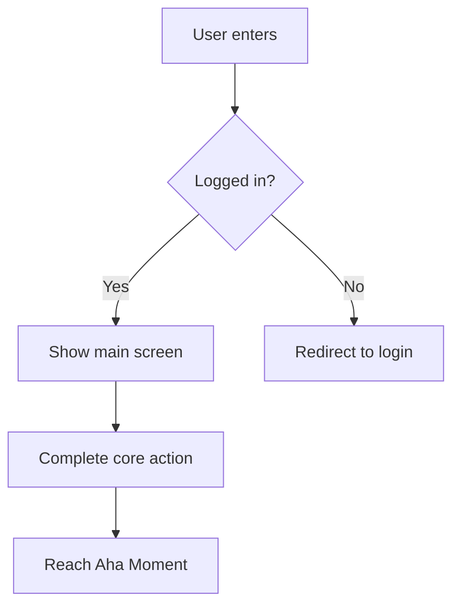
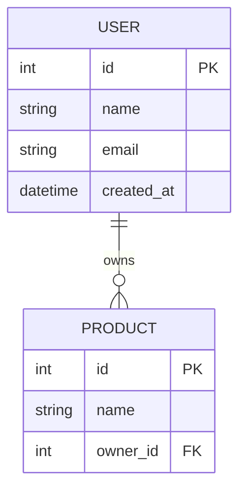

# Stage 3: Develop — Solution Design & Prioritization

## 3.2 Parallel Prototyping Principle

Develop multiple parallel approaches simultaneously — don't design a single solution and rush to execute:

```
| HMW Question | Solution A (Conservative/Incremental) | Solution B (Balanced) | Solution C (Bold/Disruptive) |
|---|---|---|---|
| [HMW1] | | | |
```

Three solution quality gates:
- Is Solution A clearly better than the current approach?
- Does Solution C actually solve the core JTBD?
- Are the three solutions genuinely different, or just variations of the same idea?

## 3.3 Shreyas Doshi's Pre-mortem

**Applicable: Medium/high completeness / audience is engineers/internal planning**

Before committing to a solution, assume it has already failed:

```
Assume: We chose Solution X and declared failure after [time period]. Why did it fail?

| Failure Reason | Likelihood (High/Med/Low) | Preventability (High/Med/Low) | Preventive Measure |
|----------------|--------------------------|-------------------------------|-------------------|
| | | | |
```

**Security failure scenarios** (must consider at least one, especially for products handling user data):

```
| Security Risk | Likelihood | Preventability | Preventive Measure |
|---------------|-----------|----------------|-------------------|
| User data breach (database intrusion, unauthorized API access) | | | |
| Mass account takeover (brute force, credential stuffing) | | | |
| API abuse (no rate limiting, mass scraping) | | | |
| XSS / CSRF attacks harming users | | | |
| Accidental exposure of sensitive data (secrets in version control, passwords in logs) | | | |
```

> If the product doesn't involve user authentication or sensitive data, mark as "Not applicable" and explain why.

## 3.4 Gibson Biddle's GEM Prioritization Model (Netflix)

```
| Feature | G (Growth) | E (Engagement) | M (Monetization) | Overall Priority |
|---------|-----------|----------------|------------------|-----------------|
| | | | | |
```

**Impact / Effort Matrix:**

```
| Feature / Solution | Impact (High/Med/Low) | Effort Required (High/Med/Low) | Quadrant |
|---|---|---|---|
| | | | Quick Win / Strategic / Fill-in / Avoid |
```

## 3.5 RICE Quantitative Prioritization

**Applicable: High completeness / audience is data scientists/executives**

```
RICE Score = (Reach × Impact × Confidence) / Effort

| Feature | Reach (users impacted/mo) | Impact (0.25/0.5/1/2/3) | Confidence (%) | Effort (person-months) | RICE Score |
|---------|--------------------------|------------------------|----------------|----------------------|------------|
| | | | | | |
```

**Impact Scale Definitions:**
| Score | Level | Criteria |
|-------|-------|----------|
| 3 | Massive | Fundamentally changes the user experience; directly solves the core JTBD |
| 2 | High | Significantly improves user experience; clear positive impact on the North Star Metric |
| 1 | Medium | Noticeable improvement; helpful for some users or some scenarios |
| 0.5 | Low | Minor improvement; nice-to-have |
| 0.25 | Minimal | Barely noticeable difference; maintenance-level work |

**Confidence Judgment Reference:**
- 100%: Supported by quantitative data (A/B tests, user data)
- 80%: Supported by qualitative data (user interviews, competitive validation)
- 50%: Reasonable hypothesis but unvalidated
- 20%: Pure intuition or guesswork

> "Don't prioritize features — prioritize problems. Features are solutions, and they only matter after you've confirmed the priority of the problems." — Shreyas Doshi

## 3.6 User Story Table

**Applicable: Audience is engineers**

```
| # | User Story | Acceptance Criteria | Priority |
|---|---|---|---|
| US1 | As a [Persona], I want to [action], so that [value] | | |
```

---

## 📄 PRD Output Format (Used when the audience is engineers)

When the user says "produce a PRD" or "produce a document for engineers," consolidate all relevant preceding steps and produce the following complete format:

```
# [Product Name] Product Requirements Document

**Version**: v[X.X]　**Date**: [Date]　**Author**: [PM Name]
**Status**: Draft / Under Review / Approved

---

## 1. Background & Objectives

**Problem Statement**: [Transformed from HMW question — one paragraph explaining what problem is solved for whom]
**Target Persona**: [Which Persona]
**Core JTBD**: [Target Customer] + wants to [Job] + in the context of [Job Context]
**Success Metrics**: [North Star Metric + Hero Metric]

---

## 2. Solution Overview (from PR-FAQ)

**Product One-liner**: [PR-FAQ headline]
**Aha Moment**: When the user completes [action], they experience the core value
**Product Positioning**: [April Dunford positioning summary, if completed]

---

## 3. Feature Scope

### MVP Must-Haves
| Feature | Description | Priority | Notes |
|---------|------------|----------|-------|
| | | P0 | |

### V2 Additions
| Feature | Description | Priority | Notes |
|---------|------------|----------|-------|
| | | P1 | |

### Explicitly Not Doing (Not Doing List)
| Not Doing | Reason |
|-----------|--------|
| | |

---

## 4. User Stories

| # | As a... | I want to... | So that... | Acceptance Criteria | Priority |
|---|---------|-------------|------------|---------------------|----------|
| US-001 | [Persona] | [Action] | [Value] | - [ ] Condition 1 | P0 |

---

## 5. Feature Specifications

> For each P0 feature, document the following:

### [Feature Name]
- **Description**: [What this feature does]
- **Trigger Condition**: [When it's triggered]
- **Happy Path**: [Step 1 → 2 → 3]
- **Edge Cases**: [Error scenarios, boundary conditions]
- **Acceptance Criteria**:
  - [ ] [Specific testable condition]
  - [ ] [Specific testable condition]

---

## 6. Technical Considerations

**Known Technical Constraints**: [Constraints engineers need to know]
**Dependencies**: [Third-party services, APIs, prerequisites from other features]
**Performance Requirements**: [Load times, concurrency, etc., if applicable]
**Security Requirements**: [Data protection, permissions, etc., if applicable]

---

## 7. Risks & Assumptions (from Pre-mortem)

| Risk | Likelihood | Impact | Preventive Measure |
|------|-----------|--------|-------------------|
| | High/Med/Low | High/Med/Low | |

**Core Assumptions**: [Assumptions that need validation — if proven wrong, the direction needs reassessment]

---

## 8. Milestones & Timeline

| Milestone | Target Date | Includes |
|-----------|------------|----------|
| Alpha | | [Minimum testable version] |
| Beta | | [Limited user testing] |
| Launch | | [Official release] |

---

## 9. Open Questions

| Question | Owner | Expected Resolution Date |
|----------|-------|------------------------|
| | | |
```

---

## 🗂️ Development Artifacts (Triggered on demand)

### Flowchart (Mermaid syntax)

When the user says "produce a flowchart," generate a Mermaid flowchart based on User Stories and feature specs:



Include: Main user flow / Key decision branches / Error scenarios

### DB Schema (Mermaid ERD syntax)

When the user says "produce a DB schema," generate a Mermaid erDiagram based on the MVP feature scope:



Include: Main entities / Relationships / Key fields (FKs, index recommendations)

### UI Wireframe (HTML wireframe)

When the user says "produce a UI wireframe," output a low-fidelity wireframe in HTML + inline CSS, including:
- Core pages (determine page count based on User Stories)
- Grayscale color scheme, no brand colors
- Annotate each element's functional purpose
- Annotate where the Aha Moment occurs

---

## 📎 File Integration Tips for This Stage

| Uploaded Content | Integrate Into | Integration Action |
|-----------------|----------------|-------------------|
| Existing PRD / requirements doc | 3.7 MVP | Extract existing feature list as reference for MVP boundary decisions |
| Technical architecture doc | 3.5 RICE (Effort) | Use real technical complexity to assess Effort scores |
| Design mockups / wireframes | 3.2 Parallel Prototyping + UI Wireframe | Use as visual reference for solutions; identify existing vs. new design needs |
| Engineering estimation doc | 3.5 RICE + 3.7 MVP | Replace assumed Effort with real estimates; adjust MVP scope |
| Past version postmortems | 3.3 Pre-mortem | Supplement risk list with historical failure lessons |
