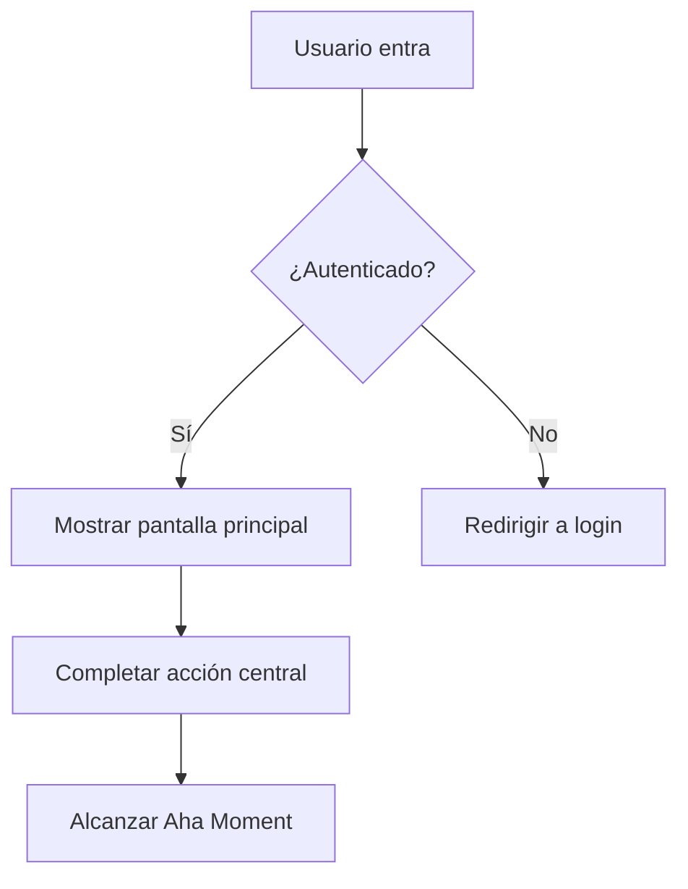
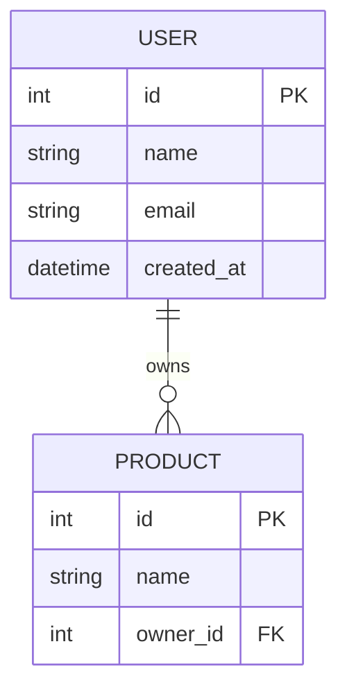

# Etapa 3: Desarrollo — Diseño de Solución y Priorización

## 3.2 Principio de Prototipado Paralelo

Desarrolla múltiples enfoques paralelos simultáneamente — no diseñes una sola solución y te apresures a ejecutar:

```
| Pregunta HMW | Solución A (Conservadora/Incremental) | Solución B (Equilibrada) | Solución C (Audaz/Disruptiva) |
|---|---|---|---|
| [HMW1] | | | |
```

Tres puertas de calidad para soluciones:
- ¿La Solución A es claramente mejor que el enfoque actual?
- ¿La Solución C realmente resuelve el JTBD central?
- ¿Las tres soluciones son genuinamente diferentes, o solo variaciones de la misma idea?

## 3.3 Pre-mortem de Shreyas Doshi

**Aplicable: Completitud media/alta / audiencia es ingenieros/planificación interna**

Antes de comprometerse con una solución, asume que ya falló:

```
Supón: Elegimos la Solución X y declaramos fracaso después de [período de tiempo]. ¿Por qué falló?

| Razón de Fracaso | Probabilidad (Alta/Media/Baja) | Prevenibilidad (Alta/Media/Baja) | Medida Preventiva |
|------------------|-------------------------------|--------------------------------|-------------------|
| | | | |
```

**Escenarios de falla de seguridad** (debe considerar al menos uno, especialmente para productos que manejan datos de usuarios):

```
| Riesgo de Seguridad | Probabilidad | Prevenibilidad | Medida Preventiva |
|---------------------|-------------|----------------|-------------------|
| Filtración de datos de usuario (intrusión a base de datos, acceso no autorizado a API) | | | |
| Toma masiva de cuentas (fuerza bruta, credential stuffing) | | | |
| Abuso de API (sin rate limiting, scraping masivo) | | | |
| Ataques XSS / CSRF perjudicando usuarios | | | |
| Exposición accidental de datos sensibles (secretos en control de versiones, contraseñas en logs) | | | |
```

> Si el producto no involucra autenticación de usuarios o datos sensibles, marca como "No aplicable" y explica por qué.

## 3.4 Modelo de Priorización GEM de Gibson Biddle (Netflix)

```
| Funcionalidad | G (Growth) | E (Engagement) | M (Monetization) | Prioridad General |
|---------------|-----------|----------------|------------------|------------------|
| | | | | |
```

**Matriz de Impacto / Esfuerzo:**

```
| Funcionalidad / Solución | Impacto (Alto/Medio/Bajo) | Esfuerzo Requerido (Alto/Medio/Bajo) | Cuadrante |
|---|---|---|---|
| | | | Quick Win / Estratégico / Complemento / Evitar |
```

## 3.5 Priorización Cuantitativa RICE

**Aplicable: Alta completitud / audiencia es científicos de datos/ejecutivos**

```
Puntuación RICE = (Reach × Impact × Confidence) / Effort

| Funcionalidad | Reach (usuarios impactados/mes) | Impact (0.25/0.5/1/2/3) | Confidence (%) | Effort (persona-meses) | Puntuación RICE |
|---------------|-------------------------------|------------------------|----------------|----------------------|----------------|
| | | | | | |
```

**Definiciones de Escala de Impacto:**
| Puntuación | Nivel | Criterio |
|-----------|-------|----------|
| 3 | Masivo | Cambia fundamentalmente la experiencia del usuario; resuelve directamente el JTBD central |
| 2 | Alto | Mejora significativamente la experiencia del usuario; impacto positivo claro en la North Star Metric |
| 1 | Medio | Mejora perceptible; útil para algunos usuarios o algunos escenarios |
| 0.5 | Bajo | Mejora menor; agradable de tener |
| 0.25 | Mínimo | Diferencia apenas perceptible; trabajo de mantenimiento |

**Referencia para Juicio de Confianza:**
- 100%: Respaldado por datos cuantitativos (pruebas A/B, datos de usuario)
- 80%: Respaldado por datos cualitativos (entrevistas de usuario, validación competitiva)
- 50%: Hipótesis razonable pero no validada
- 20%: Pura intuición o conjetura

> "No priorices funcionalidades — prioriza problemas. Las funcionalidades son soluciones, y solo importan después de que hayas confirmado la prioridad de los problemas." — Shreyas Doshi

## 3.6 Tabla de User Stories

**Aplicable: Audiencia es ingenieros**

```
| # | User Story | Criterios de Aceptación | Prioridad |
|---|---|---|---|
| US1 | Como [Persona], quiero [acción], para poder [valor] | | |
```

---

## 📄 Formato de Output PRD (Usado cuando la audiencia es ingenieros)

Cuando el usuario dice "produce un PRD" o "produce un documento para ingenieros," consolida todos los pasos relevantes anteriores y produce el siguiente formato completo:

```
# [Nombre del Producto] Documento de Requisitos de Producto

**Versión**: v[X.X]　**Fecha**: [Fecha]　**Autor**: [Nombre del PM]
**Estado**: Borrador / En Revisión / Aprobado

---

## 1. Antecedentes y Objetivos

**Declaración del Problema**: [Transformado de la pregunta HMW — un párrafo explicando qué problema se resuelve para quién]
**Persona Objetivo**: [Qué Persona]
**JTBD Central**: [Cliente Objetivo] + quiere [Job] + en el contexto de [Contexto del Job]
**Métricas de Éxito**: [North Star Metric + Hero Metric]

---

## 2. Resumen de Solución (del PR-FAQ)

**Descripción en una línea**: [Titular del PR-FAQ]
**Aha Moment**: Cuando el usuario completa [acción], experimenta el valor central
**Posicionamiento del Producto**: [Resumen de posicionamiento April Dunford, si se completó]

---

## 3. Alcance de Funcionalidades

### Imprescindibles del MVP
| Funcionalidad | Descripción | Prioridad | Notas |
|---------------|-------------|----------|-------|
| | | P0 | |

### Adiciones V2
| Funcionalidad | Descripción | Prioridad | Notas |
|---------------|-------------|----------|-------|
| | | P1 | |

### Explícitamente No Hacer (Lista de No Hacer)
| No Hacer | Razón |
|----------|-------|
| | |

---

## 4. User Stories

| # | Como un... | Quiero... | Para poder... | Criterios de Aceptación | Prioridad |
|---|-----------|-----------|--------------|------------------------|----------|
| US-001 | [Persona] | [Acción] | [Valor] | - [ ] Condición 1 | P0 |

---

## 5. Especificaciones de Funcionalidades

> Para cada funcionalidad P0, documenta lo siguiente:

### [Nombre de la Funcionalidad]
- **Descripción**: [Qué hace esta funcionalidad]
- **Condición de Activación**: [Cuándo se activa]
- **Camino Feliz**: [Paso 1 → 2 → 3]
- **Casos Límite**: [Escenarios de error, condiciones de frontera]
- **Criterios de Aceptación**:
  - [ ] [Condición específica comprobable]
  - [ ] [Condición específica comprobable]

---

## 6. Consideraciones Técnicas

**Restricciones Técnicas Conocidas**: [Restricciones que los ingenieros necesitan conocer]
**Dependencias**: [Servicios de terceros, APIs, prerequisitos de otras funcionalidades]
**Requisitos de Rendimiento**: [Tiempos de carga, concurrencia, etc., si aplica]
**Requisitos de Seguridad**: [Protección de datos, permisos, etc., si aplica]

---

## 7. Riesgos y Suposiciones (del Pre-mortem)

| Riesgo | Probabilidad | Impacto | Medida Preventiva |
|--------|-------------|---------|-------------------|
| | Alta/Media/Baja | Alto/Medio/Bajo | |

**Suposiciones Centrales**: [Suposiciones que necesitan validación — si resultan falsas, la dirección necesita reevaluación]

---

## 8. Hitos y Cronograma

| Hito | Fecha Objetivo | Incluye |
|------|---------------|---------|
| Alpha | | [Versión mínima testeable] |
| Beta | | [Pruebas con usuarios limitados] |
| Lanzamiento | | [Release oficial] |

---

## 9. Preguntas Abiertas

| Pregunta | Responsable | Fecha Esperada de Resolución |
|----------|-------------|----------------------------|
| | | |
```

---

## 🗂️ Artefactos de Desarrollo (Activados bajo demanda)

### Diagrama de Flujo (sintaxis Mermaid)

Cuando el usuario dice "produce un diagrama de flujo," genera un diagrama de flujo Mermaid basado en User Stories y especificaciones de funcionalidades:



Incluir: Flujo principal del usuario / Ramas de decisión clave / Escenarios de error

### DB Schema (sintaxis Mermaid ERD)

Cuando el usuario dice "produce un DB schema," genera un Mermaid erDiagram basado en el alcance de funcionalidades del MVP:



Incluir: Entidades principales / Relaciones / Campos clave (FKs, recomendaciones de índices)

### UI Wireframe (wireframe HTML)

Cuando el usuario dice "produce un UI wireframe," produce un wireframe de baja fidelidad en HTML + CSS inline, incluyendo:
- Páginas centrales (determinar cantidad de páginas basado en User Stories)
- Esquema de colores en escala de grises, sin colores de marca
- Anotar el propósito funcional de cada elemento
- Anotar dónde ocurre el Aha Moment

---

## 📎 Consejos de Integración de Archivos para esta Etapa

| Contenido Subido | Integrar En | Acción de Integración |
|-----------------|-------------|----------------------|
| PRD existente / documento de requisitos | 3.7 MVP | Extraer lista de funcionalidades existentes como referencia para decisiones de límite del MVP |
| Documento de arquitectura técnica | 3.5 RICE (Effort) | Usar complejidad técnica real para evaluar puntuaciones de Esfuerzo |
| Mockups de diseño / wireframes | 3.2 Prototipado Paralelo + UI Wireframe | Usar como referencia visual para soluciones; identificar necesidades de diseño existentes vs. nuevas |
| Documento de estimación de ingeniería | 3.5 RICE + 3.7 MVP | Reemplazar Esfuerzo asumido con estimaciones reales; ajustar alcance del MVP |
| Postmortems de versiones anteriores | 3.3 Pre-mortem | Complementar lista de riesgos con lecciones históricas de fracaso |
