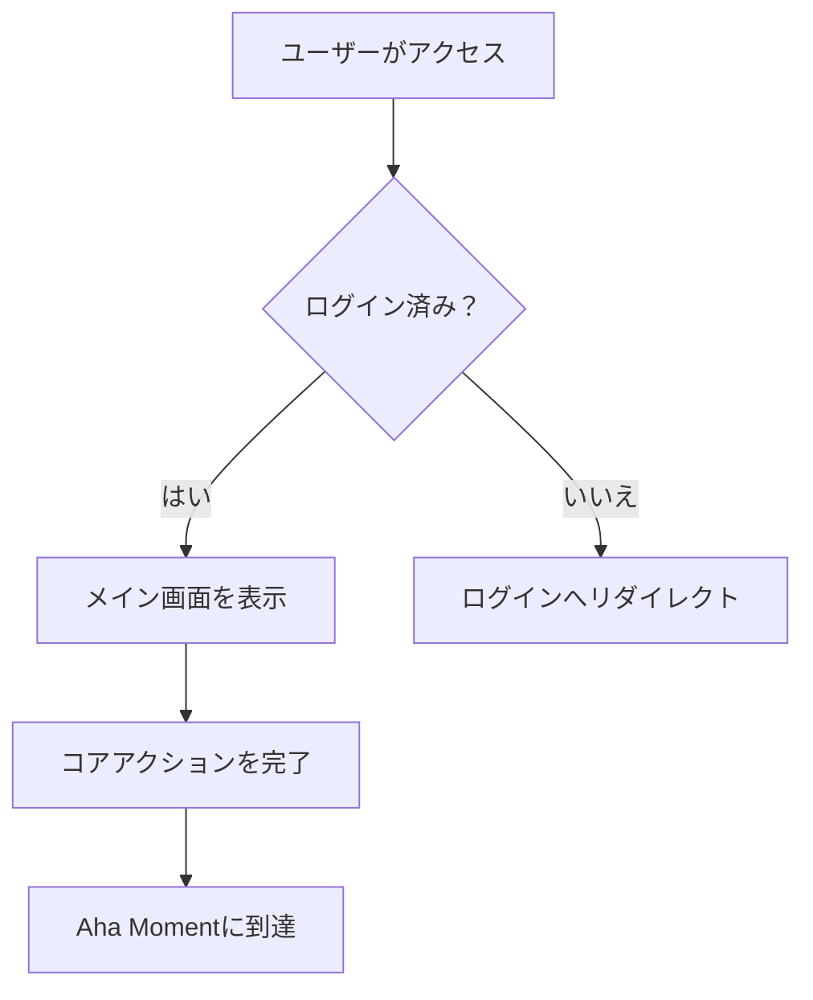
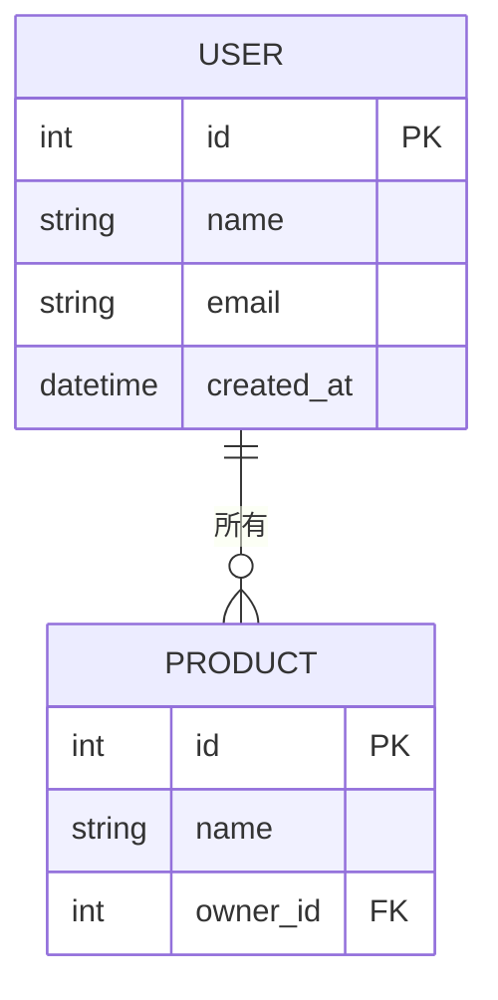

# ステージ3：Develop — ソリューション設計と優先順位付け

## 3.2 並行プロトタイピング原則

複数の並行アプローチを同時に開発 — 単一のソリューションを設計して急いで実行しない：

```
| HMW質問 | ソリューションA（保守的/漸進的） | ソリューションB（バランス型） | ソリューションC（大胆/破壊的） |
|---|---|---|---|
| [HMW1] | | | |
```

3つのソリューション品質ゲート：
- ソリューションAは現在のアプローチより明確に優れているか？
- ソリューションCはコアJTBDを本当に解決するか？
- 3つのソリューションは本当に異なるか、同じアイデアのバリエーションではないか？

## 3.3 Shreyas DoshiのPre-mortem

**対象：中/高完成度 / オーディエンスがエンジニア/内部企画の場合**

ソリューションにコミットする前に、すでに失敗したと仮定：

```
仮定：ソリューションXを選択し、[期間]後に失敗を宣言した。なぜ失敗したのか？

| 失敗理由 | 可能性（高/中/低） | 予防可能性（高/中/低） | 予防措置 |
|----------------|--------------------------|-------------------------------|-------------------|
| | | | |
```

**セキュリティ失敗シナリオ**（少なくとも1つは必ず検討、特にユーザーデータを扱うプロダクト）：

```
| セキュリティリスク | 可能性 | 予防可能性 | 予防措置 |
|---------------|-----------|----------------|-------------------|
| ユーザーデータ漏洩（データベース侵入、不正APIアクセス） | | | |
| 大量アカウント乗っ取り（ブルートフォース、クレデンシャルスタッフィング） | | | |
| API悪用（レート制限なし、大量スクレイピング） | | | |
| XSS / CSRF攻撃によるユーザー被害 | | | |
| 機密データの意図しない露出（バージョン管理にシークレット、ログにパスワード） | | | |
```

> プロダクトがユーザー認証や機密データを含まない場合は、「該当なし」と記載し理由を説明。

## 3.4 Gibson BiddleのGEM優先順位モデル（Netflix）

```
| 機能 | G（Growth） | E（Engagement） | M（Monetization） | 総合優先度 |
|---------|-----------|----------------|------------------|-----------------|
| | | | | |
```

**Impact / Effortマトリクス：**

```
| 機能 / ソリューション | インパクト（高/中/低） | 必要工数（高/中/低） | 象限 |
|---|---|---|---|
| | | | Quick Win / 戦略的 / 穴埋め / 回避 |
```

## 3.5 RICE定量的優先順位付け

**対象：高完成度 / オーディエンスがデータサイエンティスト/経営層の場合**

```
RICE Score = (Reach × Impact × Confidence) / Effort

| 機能 | Reach（影響ユーザー数/月） | Impact（0.25/0.5/1/2/3） | Confidence（%） | Effort（人月） | RICE Score |
|---------|--------------------------|------------------------|----------------|----------------------|------------|
| | | | | | |
```

**Impactスケール定義：**
| スコア | レベル | 基準 |
|-------|-------|----------|
| 3 | 巨大 | ユーザー体験を根本的に変える；コアJTBDを直接解決 |
| 2 | 高 | ユーザー体験を大幅に改善；North Star Metricに明確なポジティブインパクト |
| 1 | 中 | 顕著な改善；一部のユーザーまたはシナリオに有用 |
| 0.5 | 低 | 小さな改善；あれば良い程度 |
| 0.25 | 最小 | ほとんど違いがない；メンテナンスレベルの作業 |

**Confidence判断の参考：**
- 100%：定量データに裏付け（A/Bテスト、ユーザーデータ）
- 80%：定性データに裏付け（ユーザーインタビュー、競合検証）
- 50%：合理的な仮説だが未検証
- 20%：純粋な直感または推測

> 「機能に優先順位を付けるのではなく、問題に優先順位を付けてください。機能はソリューションであり、問題の優先順位を確認した後にのみ意味があります。」 — Shreyas Doshi

## 3.6 ユーザーストーリー表

**対象：オーディエンスがエンジニアの場合**

```
| # | ユーザーストーリー | 受入基準 | 優先度 |
|---|---|---|---|
| US1 | [ペルソナ]として、[アクション]をしたい、そうすれば[価値] | | |
```

---

## 📄 PRD出力フォーマット（オーディエンスがエンジニアの場合に使用）

ユーザーが「PRDを作成して」「エンジニア向けのドキュメントを作って」と言った場合、関連する先行ステップをすべて統合し、以下の完全なフォーマットで作成：

```
# [プロダクト名] プロダクト要件ドキュメント

**バージョン**: v[X.X]　**日付**: [日付]　**作成者**: [PM名]
**ステータス**: 下書き / レビュー中 / 承認済み

---

## 1. 背景と目標

**問題ステートメント**：[HMW質問から変換 — 誰のためにどんな問題を解決するか一段落で説明]
**ターゲットペルソナ**：[どのペルソナ]
**コアJTBD**：[ターゲット顧客] + [ジョブコンテキスト]で + [ジョブ]をしたい
**成功メトリクス**：[North Star Metric + Hero Metric]

---

## 2. ソリューション概要（PR-FAQから）

**プロダクトワンライナー**：[PR-FAQ見出し]
**Aha Moment**：ユーザーが[アクション]を完了した時、コア価値を体験する
**プロダクトポジショニング**：[April Dunfordポジショニングサマリー（完了している場合）]

---

## 3. 機能スコープ

### MVP必須機能
| 機能 | 説明 | 優先度 | 備考 |
|---------|------------|----------|-------|
| | | P0 | |

### V2追加
| 機能 | 説明 | 優先度 | 備考 |
|---------|------------|----------|-------|
| | | P1 | |

### 明示的にやらないこと（Not Doing List）
| やらないこと | 理由 |
|-----------|--------|
| | |

---

## 4. ユーザーストーリー

| # | ...として | ...したい | そうすれば... | 受入基準 | 優先度 |
|---|---------|-------------|------------|---------------------|----------|
| US-001 | [ペルソナ] | [アクション] | [価値] | - [ ] 条件1 | P0 |

---

## 5. 機能仕様

> 各P0機能について以下を文書化：

### [機能名]
- **説明**：[この機能が何をするか]
- **トリガー条件**：[いつトリガーされるか]
- **正常パス**：[ステップ1 → 2 → 3]
- **エッジケース**：[エラーシナリオ、境界条件]
- **受入基準**：
  - [ ] [具体的なテスト可能な条件]
  - [ ] [具体的なテスト可能な条件]

---

## 6. 技術的考慮事項

**既知の技術的制約**：[エンジニアが知るべき制約]
**依存関係**：[サードパーティサービス、API、他機能からの前提条件]
**パフォーマンス要件**：[ロード時間、同時接続数等（該当する場合）]
**セキュリティ要件**：[データ保護、権限等（該当する場合）]

---

## 7. リスクと仮定（Pre-mortemから）

| リスク | 可能性 | インパクト | 予防措置 |
|------|-----------|--------|-------------------|
| | 高/中/低 | 高/中/低 | |

**コア仮定**：[検証が必要な仮定 — 誤りが証明された場合、方向性の見直しが必要]

---

## 8. マイルストーンとタイムライン

| マイルストーン | 目標日 | 含まれるもの |
|-----------|------------|----------|
| Alpha | | [テスト可能な最小バージョン] |
| Beta | | [限定ユーザーテスト] |
| Launch | | [正式リリース] |

---

## 9. 未解決の質問

| 質問 | 担当者 | 予定解決日 |
|----------|-------|------------------------|
| | | |
```

---

## 🗂️ 開発アーティファクト（オンデマンドトリガー）

### フローチャート（Mermaid構文）

ユーザーが「フローチャートを作って」と言った場合、User Storiesと機能仕様に基づいてMermaidフローチャートを生成：



含めるもの：メインユーザーフロー / 重要な分岐 / エラーシナリオ

### DBスキーマ（Mermaid ERD構文）

ユーザーが「DBスキーマを作って」と言った場合、MVP機能スコープに基づいてMermaid erDiagramを生成：



含めるもの：メインエンティティ / リレーションシップ / キーフィールド（FK、インデックス推奨）

### UIワイヤーフレーム（HTMLワイヤーフレーム）

ユーザーが「UIワイヤーフレームを作って」と言った場合、HTML + インラインCSSで低忠実度ワイヤーフレームを出力。含めるもの：
- コアページ（User Storiesに基づいてページ数を決定）
- グレースケール配色、ブランドカラーなし
- 各要素の機能的な目的を注釈
- Aha Momentが発生する箇所を注釈

---

## 📎 このステージのファイル統合ヒント

| アップロード内容 | 統合先 | 統合アクション |
|-----------------|----------------|-------------------|
| 既存PRD / 要件ドキュメント | 3.7 MVP | 既存機能リストをMVP境界決定の参考として抽出 |
| 技術アーキテクチャドキュメント | 3.5 RICE（Effort） | 実際の技術的複雑さでEffortスコアを評価 |
| デザインモックアップ / ワイヤーフレーム | 3.2 並行プロトタイピング + UIワイヤーフレーム | ソリューションのビジュアル参考として使用；既存 vs 新規デザインのニーズを特定 |
| エンジニアリング見積りドキュメント | 3.5 RICE + 3.7 MVP | 仮定のEffortを実際の見積りに置き換え；MVPスコープを調整 |
| 過去バージョンのポストモーテム | 3.3 Pre-mortem | 過去の失敗教訓でリスクリストを補完 |
