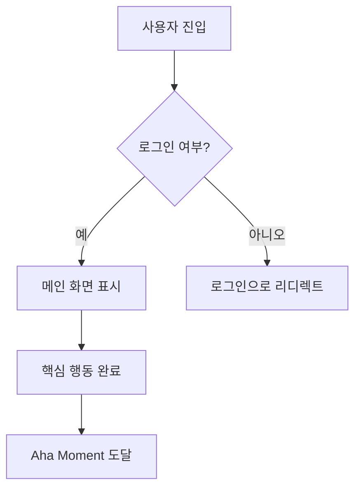
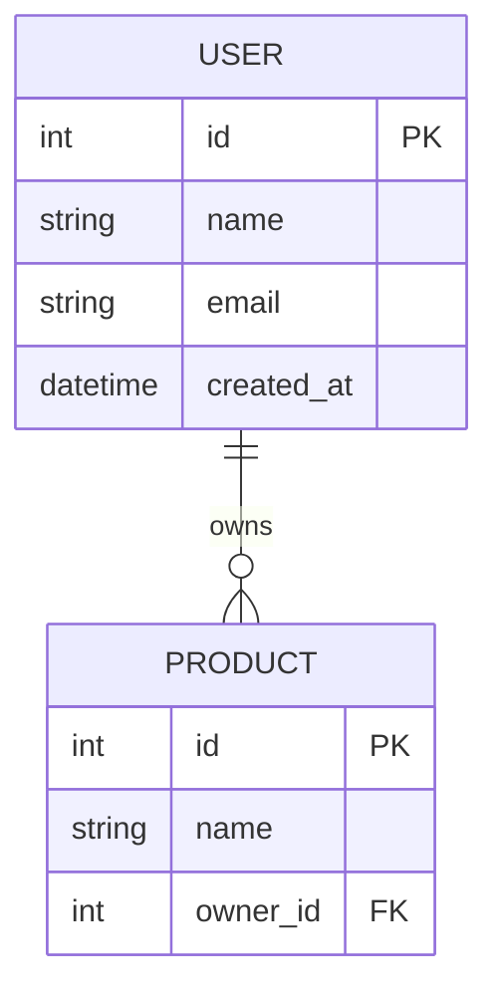

# 3단계: Develop — 솔루션 설계 및 우선순위 결정

## 3.2 병렬 프로토타이핑 원칙

단일 솔루션을 설계하고 급하게 실행하지 말고 — 여러 가지 병렬 접근법을 동시에 개발하세요:

```
| HMW 질문 | 솔루션 A (보수적/점진적) | 솔루션 B (균형적) | 솔루션 C (대담한/파괴적) |
|---------|---------------------|----------------|---------------------|
| [HMW1] | | | |
```

세 가지 솔루션 품질 게이트:
- 솔루션 A가 현재 접근법보다 확실히 나은가?
- 솔루션 C가 실제로 핵심 JTBD를 해결하는가?
- 세 가지 솔루션이 진정으로 다른가, 같은 아이디어의 변형인가?

## 3.3 Shreyas Doshi의 Pre-mortem

**적용: 중간/높은 완성도 / 독자가 엔지니어/내부 기획인 경우**

솔루션에 커밋하기 전에, 이미 실패했다고 가정하세요:

```
가정: 솔루션 X를 선택했고 [기간] 후 실패를 선언했습니다. 왜 실패했을까요?

| 실패 원인 | 가능성 (높음/중간/낮음) | 예방 가능성 (높음/중간/낮음) | 예방 조치 |
|----------|---------------------|-------------------------|----------|
| | | | |
```

**보안 실패 시나리오** (최소 1개 고려 필수, 특히 사용자 데이터를 다루는 제품):

```
| 보안 리스크 | 가능성 | 예방 가능성 | 예방 조치 |
|-----------|-------|-----------|----------|
| 사용자 데이터 유출 (데이터베이스 침입, 무단 API 접근) | | | |
| 대량 계정 탈취 (무차별 대입, 크리덴셜 스터핑) | | | |
| API 남용 (속도 제한 없음, 대량 스크래핑) | | | |
| XSS / CSRF 공격으로 사용자 피해 | | | |
| 민감한 데이터 우발적 노출 (버전 관리의 시크릿, 로그의 비밀번호) | | | |
```

> 제품이 사용자 인증이나 민감한 데이터를 다루지 않는 경우, "해당 없음"으로 표시하고 이유를 설명하세요.

## 3.4 Gibson Biddle의 GEM 우선순위 모델 (Netflix)

```
| 기능 | G (Growth) | E (Engagement) | M (Monetization) | 전체 우선순위 |
|------|-----------|----------------|------------------|------------|
| | | | | |
```

**Impact / Effort 매트릭스:**

```
| 기능 / 솔루션 | 임팩트 (높음/중간/낮음) | 필요 노력 (높음/중간/낮음) | 사분면 |
|-------------|---------------------|------------------------|--------|
| | | | Quick Win / 전략적 / 채우기 / 회피 |
```

## 3.5 RICE 정량적 우선순위 결정

**적용: 높은 완성도 / 독자가 데이터 사이언티스트/경영진인 경우**

```
RICE Score = (Reach x Impact x Confidence) / Effort

| 기능 | Reach (월간 영향 사용자) | Impact (0.25/0.5/1/2/3) | Confidence (%) | Effort (인월) | RICE Score |
|------|----------------------|------------------------|----------------|-------------|------------|
| | | | | | |
```

**Impact 척도 정의:**
| 점수 | 수준 | 기준 |
|------|------|------|
| 3 | 대규모 | 사용자 경험을 근본적으로 변화; 핵심 JTBD를 직접 해결 |
| 2 | 높음 | 사용자 경험을 크게 개선; North Star Metric에 명확한 긍정적 영향 |
| 1 | 중간 | 체감 가능한 개선; 일부 사용자나 시나리오에 도움 |
| 0.5 | 낮음 | 소소한 개선; 있으면 좋은 수준 |
| 0.25 | 최소 | 거의 체감할 수 없는 차이; 유지보수 수준의 작업 |

**Confidence 판단 기준:**
- 100%: 정량 데이터 지원 (A/B 테스트, 사용자 데이터)
- 80%: 정성 데이터 지원 (사용자 인터뷰, 경쟁 검증)
- 50%: 합리적 가설이지만 미검증
- 20%: 순수한 직감 또는 추측

> "기능의 우선순위를 정하지 마세요 — 문제의 우선순위를 정하세요. 기능은 솔루션이고, 문제의 우선순위를 확인한 후에야 의미가 있습니다." — Shreyas Doshi

## 3.6 User Story 테이블

**적용: 독자가 엔지니어인 경우**

```
| # | User Story | 인수 기준 | 우선순위 |
|---|-----------|----------|---------|
| US1 | [Persona]로서 나는 [행동]을 하고 싶어서 [가치]를 얻고 싶다 | | |
```

---

## 📄 PRD 출력 형식 (독자가 엔지니어인 경우 사용)

사용자가 "PRD를 작성해 주세요" 또는 "엔지니어용 문서를 작성해 주세요"라고 말하면, 관련 선행 단계를 통합하여 다음 완전한 형식을 작성하세요:

```
# [제품명] 제품 요구사항 명세서

**버전**: v[X.X]　**날짜**: [날짜]　**작성자**: [PM 이름]
**상태**: 초안 / 검토 중 / 승인됨

---

## 1. 배경 및 목표

**문제 정의**: [HMW 질문에서 변환 — 누구를 위해 어떤 문제를 해결하는지 한 문단]
**타겟 Persona**: [어떤 Persona]
**핵심 JTBD**: [타겟 고객] + 이 원하는 것은 [Job] + [Job 맥락]에서
**성공 지표**: [North Star Metric + Hero Metric]

---

## 2. 솔루션 개요 (PR-FAQ 기반)

**제품 원라이너**: [PR-FAQ 헤드라인]
**Aha Moment**: 사용자가 [행동]을 완료했을 때, 핵심 가치를 경험
**제품 포지셔닝**: [April Dunford 포지셔닝 요약, 완료된 경우]

---

## 3. 기능 범위

### MVP 필수 기능
| 기능 | 설명 | 우선순위 | 비고 |
|------|------|---------|------|
| | | P0 | |

### V2 추가 기능
| 기능 | 설명 | 우선순위 | 비고 |
|------|------|---------|------|
| | | P1 | |

### 명시적 제외 (Not Doing List)
| 제외 항목 | 이유 |
|----------|------|
| | |

---

## 4. User Stories

| # | ...로서 | 나는 ...하고 싶다 | 왜냐하면 ...하기 위해 | 인수 기준 | 우선순위 |
|---|---------|----------------|---------------------|----------|---------|
| US-001 | [Persona] | [행동] | [가치] | - [ ] 조건 1 | P0 |

---

## 5. 기능 상세

> 각 P0 기능에 대해 다음을 기록하세요:

### [기능명]
- **설명**: [이 기능이 하는 것]
- **트리거 조건**: [언제 트리거되는가]
- **정상 경로**: [단계 1 → 2 → 3]
- **엣지 케이스**: [에러 시나리오, 경계 조건]
- **인수 기준**:
  - [ ] [구체적 테스트 가능 조건]
  - [ ] [구체적 테스트 가능 조건]

---

## 6. 기술 고려사항

**알려진 기술 제약**: [엔지니어가 알아야 할 제약]
**의존성**: [서드파티 서비스, API, 다른 기능의 선행 조건]
**성능 요구사항**: [로드 타임, 동시성 등, 해당되는 경우]
**보안 요구사항**: [데이터 보호, 권한 등, 해당되는 경우]

---

## 7. 리스크 및 가정 (Pre-mortem 기반)

| 리스크 | 가능성 | 영향 | 예방 조치 |
|--------|-------|------|----------|
| | 높음/중간/낮음 | 높음/중간/낮음 | |

**핵심 가정**: [검증이 필요한 가정 — 틀리면 방향 재검토 필요]

---

## 8. 마일스톤 및 일정

| 마일스톤 | 목표 일자 | 포함 내용 |
|---------|----------|----------|
| Alpha | | [최소 테스트 가능 버전] |
| Beta | | [제한적 사용자 테스트] |
| Launch | | [공식 출시] |

---

## 9. 미해결 질문

| 질문 | 담당자 | 예상 해결 일자 |
|------|-------|--------------|
| | | |
```

---

## 🗂️ 개발 아티팩트 (필요시 트리거)

### 플로우차트 (Mermaid 구문)

사용자가 "플로우차트를 만들어 주세요"라고 말하면, User Stories와 기능 상세를 기반으로 Mermaid 플로우차트를 생성하세요:



포함: 주요 사용자 플로우 / 핵심 분기점 / 에러 시나리오

### DB Schema (Mermaid ERD 구문)

사용자가 "DB Schema를 만들어 주세요"라고 말하면, MVP 기능 범위를 기반으로 Mermaid erDiagram을 생성하세요:



포함: 주요 엔터티 / 관계 / 핵심 필드 (FK, 인덱스 권장사항)

### UI 와이어프레임 (HTML 와이어프레임)

사용자가 "UI 와이어프레임을 만들어 주세요"라고 말하면, HTML + 인라인 CSS로 저충실도 와이어프레임을 출력하세요:
- 핵심 페이지 (User Stories에 따라 페이지 수 결정)
- 그레이스케일 색상, 브랜드 색상 없음
- 각 요소의 기능적 목적 주석
- Aha Moment이 발생하는 위치 주석

---

## 📎 이 단계의 파일 통합 팁

| 업로드 내용 | 통합 대상 | 통합 작업 |
|------------|----------|----------|
| 기존 PRD / 요구사항 문서 | 3.7 MVP | 기존 기능 목록을 MVP 경계 결정 참고자료로 추출 |
| 기술 아키텍처 문서 | 3.5 RICE (Effort) | 실제 기술 복잡성으로 Effort 점수 평가 |
| 디자인 목업 / 와이어프레임 | 3.2 병렬 프로토타이핑 + UI 와이어프레임 | 솔루션의 시각적 참고자료로 사용; 기존 vs. 신규 디자인 니즈 식별 |
| 엔지니어링 공수 추정서 | 3.5 RICE + 3.7 MVP | 가정 기반 Effort를 실제 추정치로 대체; MVP 범위 조정 |
| 이전 버전 포스트모템 | 3.3 Pre-mortem | 과거 실패 교훈으로 리스크 목록 보완 |
