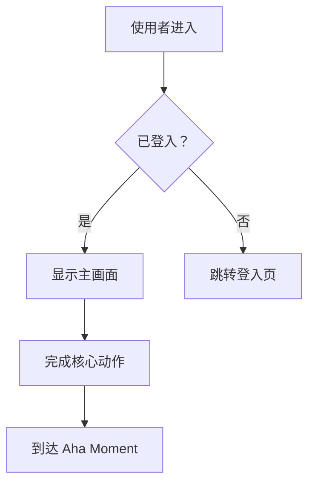
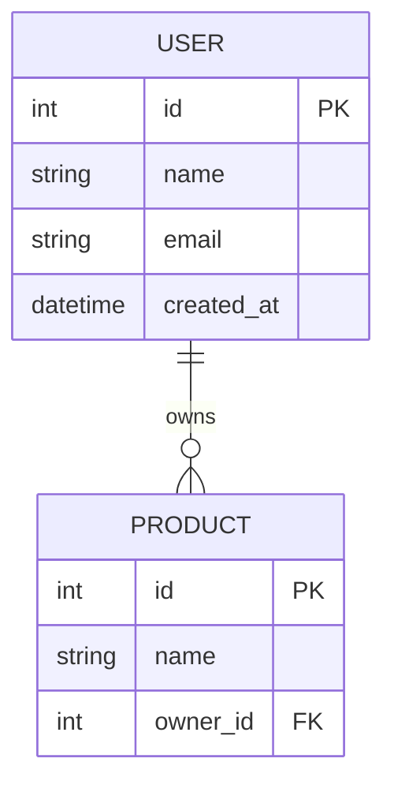

# 阶段三：Develop — 解法设计与优先排序

## 3.2 平行原型原则（Parallel Prototyping）

同时发展多个平行方案，不要只设计一个解法就急著执行：

```
| HMW 问题 | 解法 A（保守/渐进） | 解法 B（平衡） | 解法 C（大胆/颠覆） |
|---|---|---|---|
| [HMW1] | | | |
```

三个解法品质门槛：
- 解法 A 是否比现有做法明显更好？
- 解法 C 是否真的能解决核心 JTBD？
- 三个解法是否真的不同，还是只是同一个想法的微调？

## 3.3 Shreyas Doshi 的 Pre-mortem（事前验尸）

**适用于：中/高完整性 / 产出对象为工程师/自己内部规划**

选定解法之前，假设它已经失败：

```
假设：我们选择了解法 X，并在 [时间] 后宣告失败。为什么它失败了？

| 失败原因 | 发生可能性（高/中/低） | 可预防性（高/中/低） | 预防措施 |
|---------|----------------------|---------------------|---------|
| | | | |
```

**安全性失败情境**（必须至少考虑一项，特别是涉及用户数据的产品）：

```
| 安全性风险 | 发生可能性 | 可预防性 | 预防措施 |
|-----------|-----------|---------|---------|
| 用户数据泄漏（数据库入侵、API 未授权存取） | | | |
| 帐号被大量盗用（暴力破解、credential stuffing） | | | |
| API 被滥用（无 rate limiting、爬虫大量存取） | | | |
| XSS / CSRF 攻击导致用户受害 | | | |
| 敏感数据意外暴露（secrets 进版控、日志记录密码） | | | |
```

> 如果产品不涉及用户认证或敏感数据，可标记「不适用」并说明原因。

## 3.4 Gibson Biddle 的 GEM 优先排序模型（Netflix）

```
| 功能 | G（Growth 用户增长） | E（Engagement 用户黏著） | M（Monetization 商业获利） | 整体优先级 |
|------|---------------------|------------------------|--------------------------|-----------|
| | | | | |
```

**Impact / Effort Matrix：**

```
| 功能 / 解法 | 影响力（高/中/低） | 所需投入（高/中/低） | 象限 |
|---|---|---|---|
| | | | Quick Win / Strategic / Fill-in / Avoid |
```

## 3.5 RICE 量化优先排序

**适用于：高完整性 / 产出对象为数据科学家/老板**

```
RICE 分数 = (Reach × Impact × Confidence) / Effort

| 功能 | Reach（影响用户数/月） | Impact（0.25/0.5/1/2/3） | Confidence（%） | Effort（人月） | RICE 分数 |
|------|----------------------|------------------------|----------------|--------------|----------|
| | | | | | |
```

**Impact 量尺定义：**
| 分数 | 等级 | 判断依据 |
|------|------|---------|
| 3 | 极高（Massive） | 根本性改变用户体验；直接解决核心 JTBD |
| 2 | 高（High） | 显著改善用户体验；对北极星指标有明确正面影响 |
| 1 | 中（Medium） | 有感的改善；对部分用户或部分场景有帮助 |
| 0.5 | 低（Low） | 微小改善；nice-to-have |
| 0.25 | 极低（Minimal） | 几乎感觉不到差异；只是维护性质 |

**Confidence 判断参考：**
- 100%：有量化数据支持（A/B 测试、用户数据）
- 80%：有质化数据支持（用户访谈、竞品验证）
- 50%：有合理假设但未验证
- 20%：纯粹直觉或猜测

> 「不要优先排序功能（features），要优先排序问题（problems）。功能是解法，在你确认了问题的优先级之后才有意义。」— Shreyas Doshi

## 3.6 User Story 表

**适用于：产出对象为工程师**

```
| 编号 | User Story | 验收标准 | 优先级 |
|---|---|---|---|
| US1 | 身为[Persona]，我想要[功能]，以便[价值] | | |
```

---

## 📄 PRD 产出格式（产出对象为工程师时使用）

当使用者说「产出 PRD」或「产出给工程师的文件」时，整合前面所有相关步骤，产出以下完整格式：

```
# [产品名称] Product Requirements Document

**版本**：v[X.X]　**日期**：[日期]　**作者**：[PM 名称]
**状态**：草稿 / 审阅中 / 已核准

---

## 1. 背景与目标

**问题陈述**：[从 HMW 问题转化，一段话说明为谁解决什么问题]
**目标 Persona**：[哪个 Persona]
**核心 JTBD**：[Target Customer] + 想要在 [Job Context] + 完成 [Job]
**成功指标**：[North Star Metric + Hero Metric]

---

## 2. 解决方案概述（来自 PR-FAQ）

**产品一句话描述**：[PR-FAQ 标题]
**Aha Moment**：当用户完成 [行为]，他们体验到核心价值
**产品定位**：[April Dunford 定位摘要，若有执行]

---

## 3. 功能范围

### MVP 必须有
| 功能 | 说明 | 优先级 | 备注 |
|------|------|--------|------|
| | | P0 | |

### V2 加入
| 功能 | 说明 | 优先级 | 备注 |
|------|------|--------|------|
| | | P1 | |

### 明确不做（Not Doing List）
| 不做的事 | 不做的理由 |
|---------|-----------|
| | |

---

## 4. 使用者故事（User Stories）

| 编号 | As a... | I want to... | So that... | 验收标准 | 优先级 |
|------|---------|-------------|------------|---------|--------|
| US-001 | [Persona] | [行为] | [价值] | - [ ] 条件1 | P0 |

---

## 5. 功能规格

> 对每个 P0 功能，说明以下内容：

### [功能名称]
- **描述**：[这个功能做什么]
- **触发条件**：[什么情况下触发]
- **正常流程**：[步骤 1 → 2 → 3]
- **例外流程**：[错误情境、边界条件]
- **验收标准**：
  - [ ] [可测试的具体条件]
  - [ ] [可测试的具体条件]

---

## 6. 技术考量

**已知技术限制**：[列出工程师需要知道的约束]
**依赖项目**：[第三方服务、API、其他功能的前置条件]
**效能要求**：[载入时间、并发量等，若有]
**安全性要求**：[数据保护、权限等，若有]

---

## 7. 风险与假设（来自 Pre-mortem）

| 风险 | 可能性 | 影响 | 预防措施 |
|------|--------|------|---------|
| | 高/中/低 | 高/中/低 | |

**核心假设**：[需要验证的假设，若不成立则需重新评估方向]

---

## 8. 里程碑与时程

| 里程碑 | 目标日期 | 包含内容 |
|--------|---------|---------|
| Alpha | | [最小可测试版本] |
| Beta | | [有限用户测试] |
| Launch | | [正式上线] |

---

## 9. 开放问题（Open Questions）

| 问题 | 负责人 | 预计解答日期 |
|------|--------|------------|
| | | |
```

---

## 🗂️ 开发文件产出（按需触发）

### 流程图（Mermaid 语法）

当使用者说「产出流程图」时，根据 User Story 和功能规格，产出 Mermaid flowchart：



产出时涵盖：主要使用流程 / 关键分支判断 / 错误情境

### DB Schema（Mermaid ERD 语法）

当使用者说「产出 DB schema」时，根据 MVP 功能范围，产出 Mermaid erDiagram：



产出时说明：主要实体 / 关联关系 / 关键栏位（FK、索引建议）

### UI Wireframe（HTML 线框图）

当使用者说「产出 UI wireframe」时，以 HTML + 内联 CSS 产出低保真线框图，涵盖：
- 核心页面（根据 User Story 判断需要几个页面）
- 使用灰阶配色，不用品牌色
- 标注每个元素的功能说明
- 标注 Aha Moment 发生的位置

---

## 📎 本阶段的文件整合提示

| 上传内容 | 整合到 | 整合动作 |
|---------|-------|---------|
| 既有 PRD / 需求文件 | 3.7 MVP | 提取既有功能清单，作为 MVP 边界判断的参考 |
| 技术架构文件 | 3.5 RICE（Effort） | 用真实技术复杂度评估 Effort 分数 |
| 设计稿截图 / Wireframe | 3.2 平行原型 + UI Wireframe | 作为解法的视觉参考；识别已有设计和需新设计的部分 |
| 工程师估时文件 | 3.5 RICE + 3.7 MVP | 用真实估时替代假设性 Effort；调整 MVP 范围 |
| 过去版本的 Postmortem | 3.3 Pre-mortem | 从历史失败经验中补充风险清单 |
