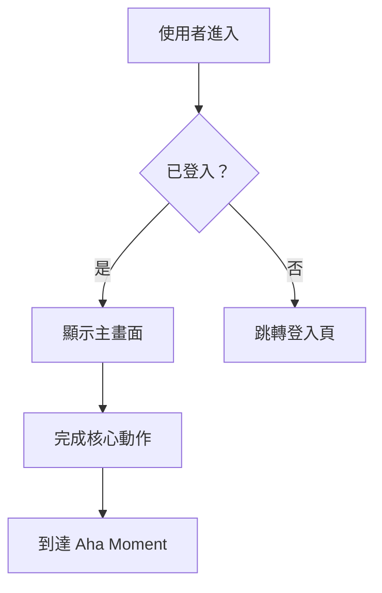
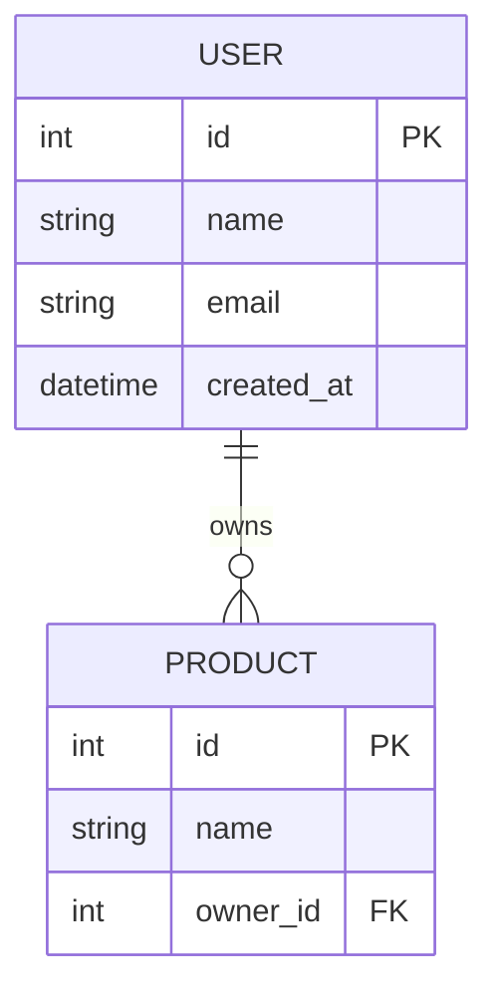

# 階段三：Develop — 解法設計與優先排序

## 3.2 平行原型原則（Parallel Prototyping）

同時發展多個平行方案，不要只設計一個解法就急著執行：

```
| HMW 問題 | 解法 A（保守/漸進） | 解法 B（平衡） | 解法 C（大膽/顛覆） |
|---|---|---|---|
| [HMW1] | | | |
```

三個解法品質門檻：
- 解法 A 是否比現有做法明顯更好？
- 解法 C 是否真的能解決核心 JTBD？
- 三個解法是否真的不同，還是只是同一個想法的微調？

## 3.3 Shreyas Doshi 的 Pre-mortem（事前驗屍）

**適用於：中/高完整性 / 產出對象為工程師/自己內部規劃**

選定解法之前，假設它已經失敗：

```
假設：我們選擇了解法 X，並在 [時間] 後宣告失敗。為什麼它失敗了？

| 失敗原因 | 發生可能性（高/中/低） | 可預防性（高/中/低） | 預防措施 |
|---------|----------------------|---------------------|---------|
| | | | |
```

**安全性失敗情境**（必須至少考慮一項，特別是涉及用戶資料的產品）：

```
| 安全性風險 | 發生可能性 | 可預防性 | 預防措施 |
|-----------|-----------|---------|---------|
| 用戶資料洩漏（資料庫入侵、API 未授權存取） | | | |
| 帳號被大量盜用（暴力破解、credential stuffing） | | | |
| API 被濫用（無 rate limiting、爬蟲大量存取） | | | |
| XSS / CSRF 攻擊導致用戶受害 | | | |
| 敏感資料意外暴露（secrets 進版控、日誌記錄密碼） | | | |
```

> 如果產品不涉及用戶認證或敏感資料，可標記「不適用」並說明原因。

## 3.4 Gibson Biddle 的 GEM 優先排序模型（Netflix）

```
| 功能 | G（Growth 用戶增長） | E（Engagement 用戶黏著） | M（Monetization 商業獲利） | 整體優先級 |
|------|---------------------|------------------------|--------------------------|-----------|
| | | | | |
```

**Impact / Effort Matrix：**

```
| 功能 / 解法 | 影響力（高/中/低） | 所需投入（高/中/低） | 象限 |
|---|---|---|---|
| | | | Quick Win / Strategic / Fill-in / Avoid |
```

## 3.5 RICE 量化優先排序

**適用於：高完整性 / 產出對象為資料科學家/老闆**

```
RICE 分數 = (Reach × Impact × Confidence) / Effort

| 功能 | Reach（影響用戶數/月） | Impact（0.25/0.5/1/2/3） | Confidence（%） | Effort（人月） | RICE 分數 |
|------|----------------------|------------------------|----------------|--------------|----------|
| | | | | | |
```

**Impact 量尺定義：**
| 分數 | 等級 | 判斷依據 |
|------|------|---------|
| 3 | 極高（Massive） | 根本性改變用戶體驗；直接解決核心 JTBD |
| 2 | 高（High） | 顯著改善用戶體驗；對北極星指標有明確正面影響 |
| 1 | 中（Medium） | 有感的改善；對部分用戶或部分場景有幫助 |
| 0.5 | 低（Low） | 微小改善；nice-to-have |
| 0.25 | 極低（Minimal） | 幾乎感覺不到差異；只是維護性質 |

**Confidence 判斷參考：**
- 100%：有量化數據支持（A/B 測試、用戶數據）
- 80%：有質化數據支持（用戶訪談、競品驗證）
- 50%：有合理假設但未驗證
- 20%：純粹直覺或猜測

> 「不要優先排序功能（features），要優先排序問題（problems）。功能是解法，在你確認了問題的優先級之後才有意義。」— Shreyas Doshi

## 3.6 User Story 表

**適用於：產出對象為工程師**

```
| 編號 | User Story | 驗收標準 | 優先級 |
|---|---|---|---|
| US1 | 身為[Persona]，我想要[功能]，以便[價值] | | |
```

---

## 📄 PRD 產出格式（產出對象為工程師時使用）

當使用者說「產出 PRD」或「產出給工程師的文件」時，整合前面所有相關步驟，產出以下完整格式：

```
# [產品名稱] Product Requirements Document

**版本**：v[X.X]　**日期**：[日期]　**作者**：[PM 名稱]
**狀態**：草稿 / 審閱中 / 已核准

---

## 1. 背景與目標

**問題陳述**：[從 HMW 問題轉化，一段話說明為誰解決什麼問題]
**目標 Persona**：[哪個 Persona]
**核心 JTBD**：[Target Customer] + 想要在 [Job Context] + 完成 [Job]
**成功指標**：[North Star Metric + Hero Metric]

---

## 2. 解決方案概述（來自 PR-FAQ）

**產品一句話描述**：[PR-FAQ 標題]
**Aha Moment**：當用戶完成 [行為]，他們體驗到核心價值
**產品定位**：[April Dunford 定位摘要，若有執行]

---

## 3. 功能範圍

### MVP 必須有
| 功能 | 說明 | 優先級 | 備註 |
|------|------|--------|------|
| | | P0 | |

### V2 加入
| 功能 | 說明 | 優先級 | 備註 |
|------|------|--------|------|
| | | P1 | |

### 明確不做（Not Doing List）
| 不做的事 | 不做的理由 |
|---------|-----------|
| | |

---

## 4. 使用者故事（User Stories）

| 編號 | As a... | I want to... | So that... | 驗收標準 | 優先級 |
|------|---------|-------------|------------|---------|--------|
| US-001 | [Persona] | [行為] | [價值] | - [ ] 條件1 | P0 |

---

## 5. 功能規格

> 對每個 P0 功能，說明以下內容：

### [功能名稱]
- **描述**：[這個功能做什麼]
- **觸發條件**：[什麼情況下觸發]
- **正常流程**：[步驟 1 → 2 → 3]
- **例外流程**：[錯誤情境、邊界條件]
- **驗收標準**：
  - [ ] [可測試的具體條件]
  - [ ] [可測試的具體條件]

---

## 6. 技術考量

**已知技術限制**：[列出工程師需要知道的約束]
**依賴項目**：[第三方服務、API、其他功能的前置條件]
**效能要求**：[載入時間、併發量等，若有]
**安全性要求**：[資料保護、權限等，若有]

---

## 7. 風險與假設（來自 Pre-mortem）

| 風險 | 可能性 | 影響 | 預防措施 |
|------|--------|------|---------|
| | 高/中/低 | 高/中/低 | |

**核心假設**：[需要驗證的假設，若不成立則需重新評估方向]

---

## 8. 里程碑與時程

| 里程碑 | 目標日期 | 包含內容 |
|--------|---------|---------|
| Alpha | | [最小可測試版本] |
| Beta | | [有限用戶測試] |
| Launch | | [正式上線] |

---

## 9. 開放問題（Open Questions）

| 問題 | 負責人 | 預計解答日期 |
|------|--------|------------|
| | | |
```

---

## 🗂️ 開發文件產出（按需觸發）

### 流程圖（Mermaid 語法）

當使用者說「產出流程圖」時，根據 User Story 和功能規格，產出 Mermaid flowchart：



產出時涵蓋：主要使用流程 / 關鍵分支判斷 / 錯誤情境

### DB Schema（Mermaid ERD 語法）

當使用者說「產出 DB schema」時，根據 MVP 功能範圍，產出 Mermaid erDiagram：



產出時說明：主要實體 / 關聯關係 / 關鍵欄位（FK、索引建議）

### UI Wireframe（HTML 線框圖）

當使用者說「產出 UI wireframe」時，以 HTML + 內聯 CSS 產出低保真線框圖，涵蓋：
- 核心頁面（根據 User Story 判斷需要幾個頁面）
- 使用灰階配色，不用品牌色
- 標注每個元素的功能說明
- 標注 Aha Moment 發生的位置

---

## 📎 本階段的檔案整合提示

| 上傳內容 | 整合到 | 整合動作 |
|---------|-------|---------|
| 既有 PRD / 需求文件 | 3.7 MVP | 提取既有功能清單，作為 MVP 邊界判斷的參考 |
| 技術架構文件 | 3.5 RICE（Effort） | 用真實技術複雜度評估 Effort 分數 |
| 設計稿截圖 / Wireframe | 3.2 平行原型 + UI Wireframe | 作為解法的視覺參考；識別已有設計和需新設計的部分 |
| 工程師估時文件 | 3.5 RICE + 3.7 MVP | 用真實估時替代假設性 Effort；調整 MVP 範圍 |
| 過去版本的 Postmortem | 3.3 Pre-mortem | 從歷史失敗經驗中補充風險清單 |
